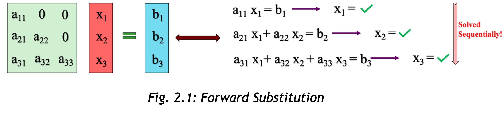
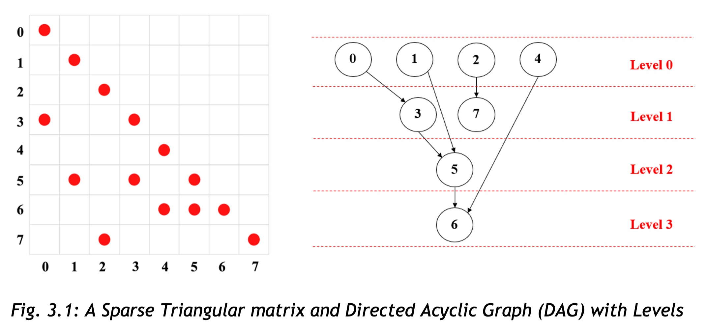
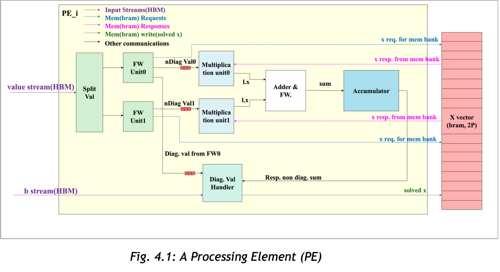
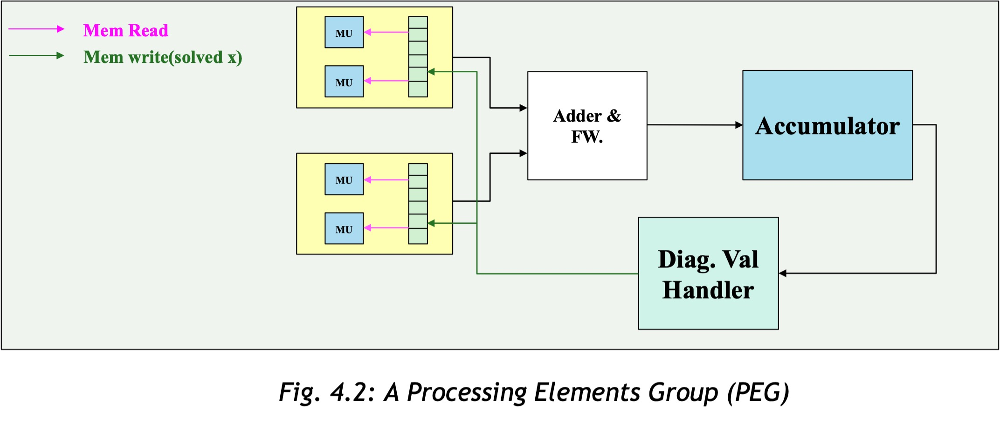
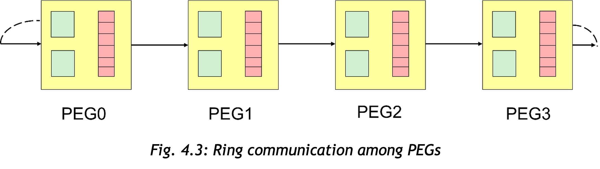

# SpTRSV_Stuff

Sparse Triangular Solver (SpTRSV) is a major bottleneck in scientific computations. The inherently sequential nature of triangular solvers forces computations to proceed step by step, resulting in significant delays. However, for SpTRSV, the sparsity pattern of the matrix can provide opportunities for parallelism, which can be exploited to accelerate the process. In this study, I proposed a hardware architecture to speed up SpTRSV computations and analyzed its performance across different input matrix types. A detailed description is available in my [report](https://github.com/dilshansk/SpTRSV_Stuff/blob/main/documents/Evaluating%20SpTRSV%20Design%20Performance%20for%20FPGAs-Report.pdf) and [presentation](https://github.com/dilshansk/SpTRSV_Stuff/blob/main/documents/Evaluating%20SpTRSV%20Design%20Performance%20for%20FPGAs-Presentation.pdf).

## In a Nutshell

* The basic idea of a triangular solver is found under the terms “forward substitution” and “backward substitution” in the literature. The process of solving a set of linear algebraic equations in the form of $Lx = y$, where $L$ is a lower triangular matrix, is called forward substitution.

<table>
  <tr>
    <td align="center">
       
    </td>
  </tr>
</table>

* A Directed Acyclic Graph can be used to visualize the dependencies among the rows of the triangle.

<table>
  <tr>
    <td align="center">
       
    </td>
  </tr>
</table>

* A **processing element (PE)** is proposed, as shown below, which is equipped with all the computation units required to perform SpTRSV computation. Since multiple multiplication units are included inside the PE, parallelism within a row (i.e., non-zero values inside the row) is utilized in the PE.

<table>
  <tr>
    <td align="center">
       
    </td>
  </tr>
</table>

* A PE can be further extended into a **processing element group (PEG)** to distribute the parallelism within a row more effectively.

<table>
  <tr>
    <td align="center">
       
    </td>
  </tr>
</table>

* Different rows in a level can be allocated to different PEGs for parallel processing (i.e., row parallelism). However, it is necessary for every PEG to be updated with all the newly solved $x_i$ values before moving to the next level. Since all-to-all broadcasting is very costly in FPGAs, the ring communication method can be used to broadcast data to all PEGs, as shown in the following figure.

<table>
  <tr>
    <td align="center">
       
    </td>
  </tr>
</table>

